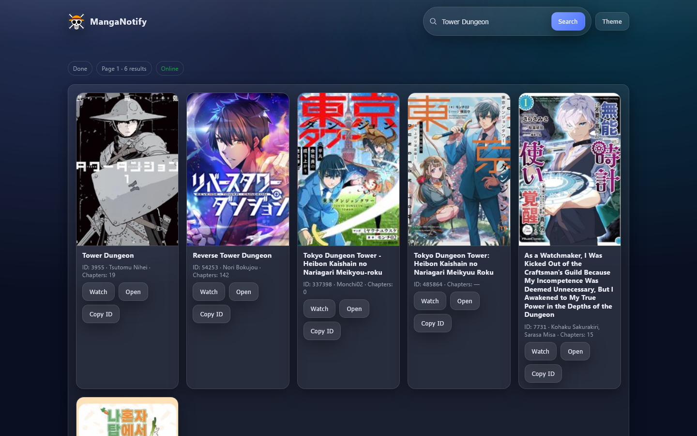
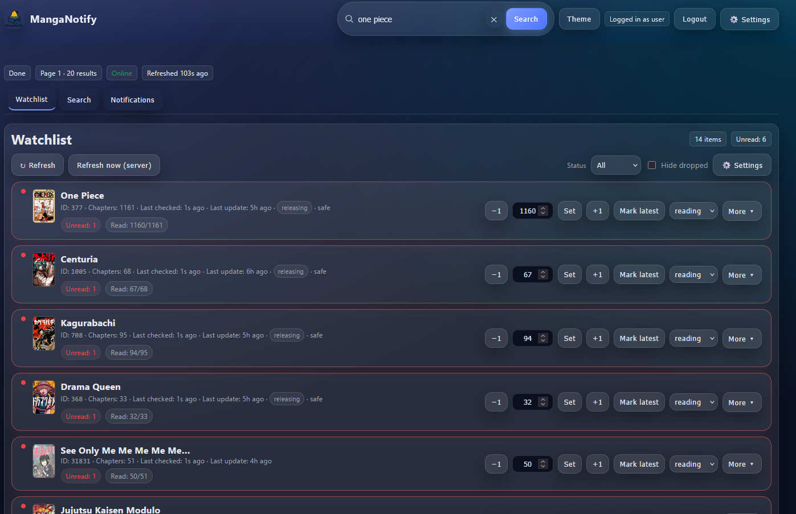

# MangaNotify


MangaNotify is a lightweight dashboard for tracking manga chapter releases via the [MangaBaka API](https://mangabaka.dev) with optional push notifications (Pushover and Discord). It runs as a tiny FastAPI service with a static web UI.

---

## ✨ Features
- 🔍 Fast search via MangaBaka API with client-side filters
- 📑 Watchlist with progress tracking and per-item status
  - Statuses: `reading`, `to-read`, `on-hold`, `finished`, `dropped`
  - Mark latest, +/- chapter, set exact last read
- 🔔 Advanced Notifications
  - Pushover (token + user)
  - Discord webhook (optional, toggleable)
  - Per-series notification preferences
  - Quiet hours with customizable time ranges
  - Notification batching (hourly/daily digests)
  - Smart filtering (only notify when actively reading)
- 🔐 Optional Authentication
  - JWT-based login system
  - Secure your instance behind reverse proxy
  - Configurable token expiration
- 🖥️ Polished web UI with extensive customization
  - Multiple layout options (tabs, stacked, custom arrangements)
  - Layout density controls (compact, normal, spacious)
  - Customizable font sizes and accent colors
  - Information display toggles (IDs, timestamps, ratings, status badges)
  - Emoji icon preferences and theme switching
  - Auto-refresh intervals and sorting options
  - Status filter and "Hide dropped" functionality
  - Details dialog, covers with lazy loading, cached searches
- 🐳 Runs great in Docker (read-only FS, `/data` volume, healthcheck)

<p align="center">
  
    <br><br/>
  
</p>

---

## 🚀 Getting Started

### Docker (recommended)

**Pull the image**
```bash
docker pull ghcr.io/gregoryn22/manganotify:latest
```

**Run a container**
```bash
docker run -d --name manganotify \
  -p 8999:8999 \
  -e MANGABAKA_BASE=https://api.mangabaka.dev \
  -e POLL_INTERVAL_SEC=1800 \
  -e CORS_ALLOW_ORIGINS=* \
  -e PUSHOVER_APP_TOKEN=xxx \
  -e PUSHOVER_USER_KEY=yyy \
  -e DISCORD_ENABLED=false \
  -e DISCORD_WEBHOOK_URL= \
  -e DATA_DIR=/data \
  -v $PWD/data:/data \
  ghcr.io/gregoryn22/manganotify:latest
```

Then open [http://localhost:8999](http://localhost:8999).

### 🔧 Secure Setup Wizard

MangaNotify includes a built-in setup wizard for secure credential management:

1. **Web Setup (Recommended):**
   - Visit `http://localhost:8999/setup`
   - Configure authentication, notifications, and other settings
   - Generate encrypted credentials automatically
   - Copy the generated `.env` configuration

2. **CLI Setup:**
   ```bash
   python scripts/setup_cli.py
   ```

3. **Manual Setup:**
   ```bash
   cp env.example .env
   # edit .env as desired, then:
   docker compose up -d
   ```

The setup wizard provides:
- ✅ **Secure password hashing** with bcrypt
- ✅ **Encrypted credential storage** for Pushover/Discord
- ✅ **Credential testing** before saving
- ✅ **Generated configuration** ready for production

#### Environment Variables

| Variable             | Default                     | Description                                |
|----------------------|-----------------------------|--------------------------------------------|
| `MANGABAKA_BASE`     | `https://api.mangabaka.dev` | Base API endpoint                          |
| `DATA_DIR`           | `./data` (local) / `/data`  | Storage for watchlist + state              |
| `POLL_INTERVAL_SEC`  | `1800` (30 min)             | Poll interval for new chapters             |
| `CORS_ALLOW_ORIGINS` | `*`                         | CORS allowlist (comma-separated or `*`)    |
| `LOG_LEVEL`          | `INFO`                      | Logging level (DEBUG, INFO, WARNING, ERROR)|
| `LOG_FORMAT`         | `plain`                     | `plain` or `json`                          |
| `PUSHOVER_APP_TOKEN` | *(none)*                    | [Pushover](https://pushover.net) app token |
| `PUSHOVER_USER_KEY`  | *(none)*                    | Pushover user key                          |
| `DISCORD_ENABLED`    | `false`                     | Enable Discord notifications               |
| `DISCORD_WEBHOOK_URL`| *(none)*                    | Discord webhook URL                        |
| `AUTH_ENABLED`       | `false`                     | Enable authentication                      |
| `AUTH_SECRET_KEY`    | *(none)*                    | JWT secret key (required if auth enabled) |
| `AUTH_USERNAME`      | `admin`                     | Login username                             |
| `AUTH_PASSWORD`      | *(none)*                    | Login password (required if auth enabled) |
| `AUTH_TOKEN_EXPIRE_HOURS` | `24`                   | JWT token expiration in hours             |

---

### Local (Python)

**Requirements:** Python 3.11+

```bash
git clone https://github.com/gregoryn22/MangaNotify
cd MangaNotify

# Create and activate virtualenv
python -m venv .venv
.venv\Scripts\activate    # Windows
source .venv/bin/activate # Linux/Mac

# Install deps and run
pip install -r requirements.txt
cd src
uvicorn manganotify.main:app --host 0.0.0.0 --port 8999
```

Open [http://localhost:8999](http://localhost:8999).

---

## ⚙️ Settings & Customization

MangaNotify offers extensive customization options accessible through the Settings panel (⚙️ icon):

### 🎨 Display & Layout
- **Layout Options**: Choose between tabs, stacked, or custom arrangements
- **Layout Density**: Compact, normal, or spacious spacing
- **Font Size**: Small, normal, or large text sizing
- **Accent Color**: Custom color picker with reset option
- **Theme**: Light/dark mode with system preference detection
- **Emoji Icons**: Toggle emoji usage throughout the interface

### 📊 Information Display
- **Show Series IDs**: Display manga IDs in watchlist
- **Show Last Checked**: Display timestamp of last chapter check
- **Show Content Rating**: Display age/content rating badges
- **Show Status Badges**: Display reading status indicators
- **Show Covers**: Toggle cover images (saves bandwidth)

### 📋 Watchlist Management
- **Sorting Options**: Title, unread chapters, total chapters, last checked, or added date
- **Sort Direction**: Ascending or descending
- **Unread Only**: Filter to show only series with unread chapters
- **Auto-refresh**: Set intervals (1min, 5min, 15min, or off)
- **Bulk Actions**: Mark all visible items as latest, export/import watchlist

### 🔔 Notification Preferences
- **Quiet Hours**: Suppress notifications during specified time ranges
- **Notification Batching**: 
  - Off (immediate notifications)
  - Hourly digest
  - Daily digest
- **Per-Series Settings**: Individual notification preferences for each manga
- **Smart Filtering**: Only notify when series status is "reading"

### 🔍 Search & Filters
- **Client-side Filters**: Status, type, anime adaptation, content rating
- **Search Persistence**: Cached searches and filter states
- **Advanced Filtering**: Multiple criteria combinations

All settings are automatically saved to browser localStorage and persist across sessions.

---

## 🛠 Roadmap
- [ ] Export/import UI for notifications history
- [ ] Optional reverse-proxy snippets (Caddy/Nginx)
- [ ] i18n for UI strings

---

## CI: Build & Publish Docker Image

This repo includes a GitHub Actions workflow to build and push a multi-arch Docker image on tag and on pushes to `main`.

1) Add repository secrets:
- `REGISTRY` (e.g., `ghcr.io`)
- `IMAGE_NAME` (e.g., `ghcr.io/<owner>/manganotify`)
- `REGISTRY_USERNAME` and `REGISTRY_TOKEN` (or `CR_PAT` for GitHub Container Registry)

2) Tag and push:
```bash
git tag v0.5.0
git push --tags
```

The workflow will produce `latest` and semver tags and push for linux/amd64 and linux/arm64.

**Container Registry:** Images are published to [GitHub Container Registry](https://github.com/gregoryn22/MangaNotify/pkgs/container/manganotify) and can be pulled with:

```bash
docker pull ghcr.io/gregoryn22/manganotify:latest
```

**Workflow Details:**
- Triggers on pushes to `main` branch and tag creation
- Builds multi-architecture images (linux/amd64, linux/arm64)
- Uses GitHub Container Registry (ghcr.io)
- Includes semantic versioning support (v1.0.0, v1.0, v1, latest)
- Caches Docker layers for faster builds

---

## Security

### Authentication

MangaNotify supports optional JWT-based authentication to secure your instance:

```bash
# Enable authentication
export AUTH_ENABLED=true
export AUTH_SECRET_KEY="your-secure-random-key-here"
export AUTH_PASSWORD="your-secure-password"

# Optional: customize username and token expiration
export AUTH_USERNAME="myuser"
export AUTH_TOKEN_EXPIRE_HOURS=48
```

**Security Notes:**
- Generate a strong `AUTH_SECRET_KEY` (32+ characters, random)
- Use a strong password for `AUTH_PASSWORD`
- When auth is enabled, all API endpoints require authentication
- Tokens are stored in browser `localStorage` and sent via `Authorization: Bearer` header
- Consider using HTTPS in production, especially with reverse proxies

### Reverse Proxy Setup

Example nginx configuration for secure access:

```nginx
server {
    listen 443 ssl;
    server_name your-domain.com;
    
    ssl_certificate /path/to/cert.pem;
    ssl_certificate_key /path/to/key.pem;
    
    location / {
        proxy_pass http://localhost:8999;
        proxy_set_header Host $host;
        proxy_set_header X-Real-IP $remote_addr;
        proxy_set_header X-Forwarded-For $proxy_add_x_forwarded_for;
        proxy_set_header X-Forwarded-Proto $scheme;
    }
}
```

---

## 🧪 Testing

Run the test suite:

```bash
# Install test dependencies
pip install pytest respx

# Run all tests
python -m pytest tests/ -v

# Run specific test files
python -m pytest tests/test_auth.py -v
python -m pytest tests/test_integration.py -v
```

The test suite includes:
- **Authentication tests** - JWT token creation, validation, login/logout flows
- **Integration tests** - Full auth flow with protected endpoints
- **API tests** - Notification system and external API mocking
- **Error handling** - Malformed requests, expired tokens, invalid credentials

---

## 🤝 Contributing
This is still early and experimental — feedback, issues, and PRs are very welcome!  
If I can make it 20% functional, imagine what you can do 😉

---
## Data Attribution
- [MangaBaka](https://mangabaka.dev)
- [AniList](https://anilist.co)
- [Kitsu](https://kitsu.app)
- [MangaDex](https://mangadex.org)
- [MangaUpdates](https://www.mangaupdates.com)
- [MyAnimeList](https://myanimelist.net)