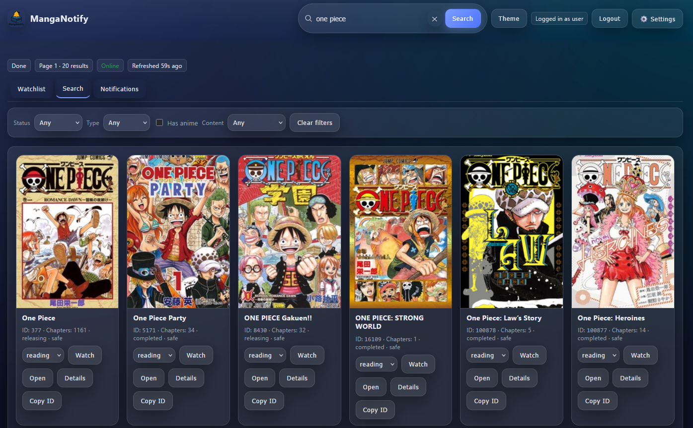

# MangaNotify


MangaNotify is a lightweight tool for tracking manga chapter releases via the [MangaBaka API](https://mangabaka.dev) and sending push notifications to your phone with [Pushover](https://pushover.net).  
*(Discord support planned!)*

---

## ✨ Features
- 🔍 Search for manga using MangaBaka API  
- 📑 Add series to a personal watchlist  
- 📲 Send notifications via Pushover  
- 🖥️ Simple web UI for search and watchlist  
- 🐳 Run locally or as a Docker container  

<p align="center">
  
  
</p>

---

## 🚀 Getting Started

### Docker (recommended)

**Pull the image**
```bash
docker pull ghcr.io/gregoryn22/manganotify:latest
```

**Run a container**
```bash
docker run -d --name manganotify \
  -p 8999:8999 \
  -e MANGABAKA_BASE=https://api.mangabaka.dev \
  -e POLL_INTERVAL_SEC=1800 \
  -e PUSHOVER_APP_TOKEN=xxx \
  -e PUSHOVER_USER_KEY=yyy \
  -e DATA_DIR=/data \
  -v $PWD/data:/data \
  ghcr.io/gregoryn22/manganotify:latest
```

Then open [http://localhost:8999](http://localhost:8999).

#### Environment Variables

| Variable             | Default                     | Description                                |
|----------------------|-----------------------------|--------------------------------------------|
| `MANGABAKA_BASE`     | `https://api.mangabaka.dev` | Base API endpoint                          |
| `DATA_DIR`           | `./data` (local) / `/data`  | Storage for watchlist + state              |
| `POLL_INTERVAL_SEC`  | `1800` (30 min)             | Poll interval for new chapters             |
| `PUSHOVER_APP_TOKEN` | *(none)*                    | [Pushover](https://pushover.net) app token |
| `PUSHOVER_USER_KEY`  | *(none)*                    | Pushover user key                          |

---

### Local (Python)

**Requirements:** Python 3.13+

```bash
git clone https://github.com/gregoryn22/MangaNotify
cd MangaNotify

# Create and activate virtualenv
python -m venv .venv
.venv\Scripts\activate    # Windows
source .venv/bin/activate # Linux/Mac

# Install deps and run
pip install -r requirements.txt
python server.py
```

Open [http://localhost:8999](http://localhost:8999).

---

## 🛠 Roadmap
- [ ] Add logging  
- [ ] Improve UI design  
- [ ] Add Discord notifications  
- [ ] Improve container usability  

---

## 🤝 Contributing
This is still early and experimental — feedback, issues, and PRs are very welcome!  
If I can make it 20% functional, imagine what you can do 😉
